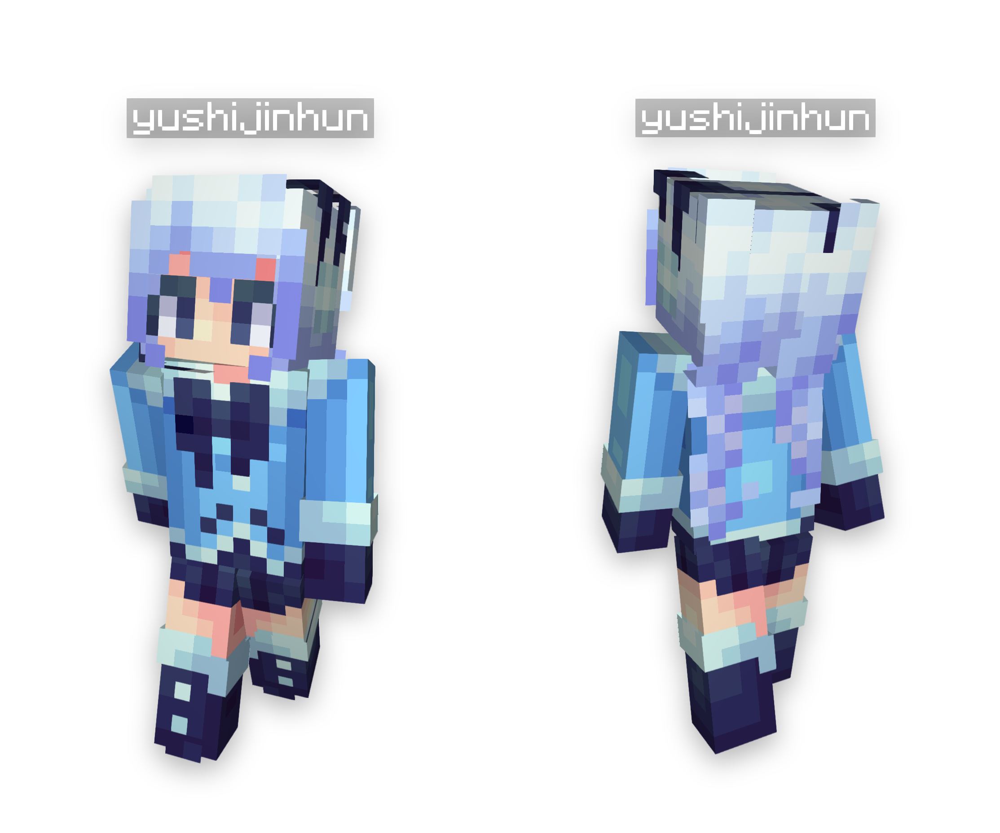

# SkinRenderMC  你先别急皮肤渲染器

> [!TIP]  
> 此项目尚处于开发阶段，我很快就会更新这个项目。

> [!TIP]
>
> SkinRenderMC 所使用的 Docker Image 也被上传至 **腾讯云** 和 **阿里云** 容器镜像仓库中。
>
> `jinzhijie/skinrendermc-api:latest`  
> - `registry.cn-shanghai.aliyuncs.com/serinanya/skinrendermc-api:latest`  
> - `ccr.ccs.tencentyun.com/serinanya/skinrendermc-api:latest`
> 
> `browserless/chrome:latest`  
> - `registry.cn-shanghai.aliyuncs.com/serinanya/browserless/chrome:latest`  
> - `ccr.ccs.tencentyun.com/serinanya/browserless/chrome:latest`
>
> `jinzhijie/skinrendermc-skinview3d:latest`  
> - `registry.cn-shanghai.aliyuncs.com/serinanya/skinrendermc-skinview3d:latest`  
> - `ccr.ccs.tencentyun.com/serinanya/skinrendermc-skinview3d:latest`


# 此灵车能做什么？


给它一个 HTTP 请求：


```plain
GET http://<your_server>:57680/url/image/both
    ?skinUrl=<your_skin_url>
    &capeUrl=<your_cape_url>
    &nameTag=<your_player_name>
    &definition=1.5
    &transparent=false
```


它会输出：





没错，此灵车基于 [`bs-community/skinview3d`](https://github.com/bs-community/skinview3d)，开发者 [`yushijinhun`](https://github.com/yushijinhun) 是 `skinview3d` 的现任主要维护者。


非常感谢 `yushijinhun` 在 SkinRenderMC 的开发过程中对我的指导和帮助！


# 此灵车目前接受的一些参数的详解


- `definition`  
    浮点型，默认 `1.5`  


    `0.8 <= definition <= 3.0`。值越大，越清晰，分辨率越大，数据大小越大。反之亦然。


- `transparent`
    布尔型，默认 `false`  


    值为 `true` 时，吐出来的图片的背景是透明的。


# 部署此灵车

> [!IMPORTANT]  
> 需要**至少**_2 CPU 核心 & 2GB 运行内存_ 来运行这个程序！  
> 
> 推荐配置为 **4 CPU 核心 & 4GB 运行内存**

看看那个人畜无害的 `docker-compose.yml` 你就知道了！

```sh
mkdir skinrendermc && cd skinrendermc
curl -O docker-compose.yml https://github.com/SerinaNya/SkinRenderMC/raw/master/docker-compose.yml
sudo docker compose up -d
```

服务器将在 `57680` 端口上启动，访问 `http://<ip>:56780/docs` 查看 OpenAPI 文档。

---

# 中文特供部分

## 真的很急咋办？

速度确实有些慢，这主要是 Headless Chrome 使用 WebGL 渲染导致的，他们无头浏览器是这样的。

可以尝试提高运行设备的配置，或参考下述方案调整输出。

## 糊！

> 值越大，越清晰，分辨率越大，数据大小越大。

经过测试，`definition=1.5` 能满足大部分场景下的需求。`1.25` 也能将就着用用。

## 就这么一个功能？

错误的，是文档来不及写。

此灵车支持 `image/png` 和 `application/json` 格式的响应，支持 前、后、前+后 的响应，在 json 里还能顺带告诉你传入的皮肤是不是 slim。

## 为什么叫灵车？

因为没有 Star。你知道我要说什么的 →  <https://github.com/SerinaNya/SkinRenderMC>

你的 Star 就是我的动力！